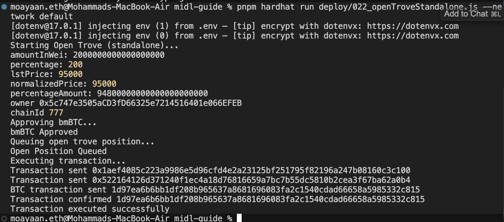

# Midl Testnet Address

(Deployment script npx hardhat deploy --tags Demo )

---

BimaWrappedCollateralFactory: `0xd0025732dc2B081D3c4ee166A125D3c8E0f253C2`

BimaCore: `0x43fF1822De3F971B3073D2471D4bd2a9899C683F`

PriceFeed: `0x7272A1b7B820e2D1F0e5176A261d03F2aF44C9db`

GasPool: `0x3fd036a43A940A5321A72d72B2E207EBD3C5b9fF`

SortedTroves: `0xFB881Ab1cDa92910947E1538E2A9857A942Ea138`

Factory: `0xD924432F9EceB17c6a3B073c627f42BcBa5B2CBB`

LiquidationManager: `0xa47e7224b10D93d046b352A613F91C322c82E3fa`

DebtToken: `0xAF49b4654e54fe30247Ed1CE029cAeAf9f027Fba`

BorrowerOperations: `0xAc74CdD083F1993B478b34e6bFAd81F274313c17`

StabilityPool: `0x6992da9BF0c7fdda8e57F716EF56ae41293c43c6`

TroveManager: `0xd3e3c7eaF35903B920267cC3AB85551df239A2c9`

TokenLocker: `0x4d459D838D434a706B4058137f48B8101ea79C0A`

IncentiveVoting: `0xFB16398878cDe4984272A309E545073546Ed9752`

BimaToken: `0x63B04c36934ca6fd410FB85628a0A02833ad1Bc3`

BimaVault: `0xa3BD70A15c97F29016a4c089A9cd12c8B49f920B`

MultiCollateralHintHelpers: `0x959CfCD21aC28d70E1b0B05f5743a98885D5503F`

MultiTroveGetter: `0xc90FD445B32453AC509619655465Bc03a3889E3C`

TroveManagerGetters: `0x0EcFB4F9c95b2FbDB1C879C8E08d6bA23F77ba4F`

StakedBTC: `0x88c58787b669DD88D2285a206Bd0FB065621023f`

MockOracle: `0xE84c73F664F719986CE026F74aE8D098CBa938a3`

New TroveManager Address: `0x1b0699adD8E8f515d9705d16A3d5c58242B84f92`

TEST TRANSACTIONS HASHES:

`Transaction sent 0x1aef4085c223a9986e5d96cfd4e2a23125bf251795f82196a247b08160c3c100`

`Transaction sent 0x522164126d371240f1ec4a18d76816659a7bc7b55dc5810b2cea3f67ba62a0b4`

`BTC transaction sent 1d97ea6b6bb1df208b965637a8681696083fa2c1540cdad66658a5985332c815`

`Transaction confirmed 1d97ea6b6bb1df208b965637a8681696083fa2c1540cdad66658a5985332c815`

  

